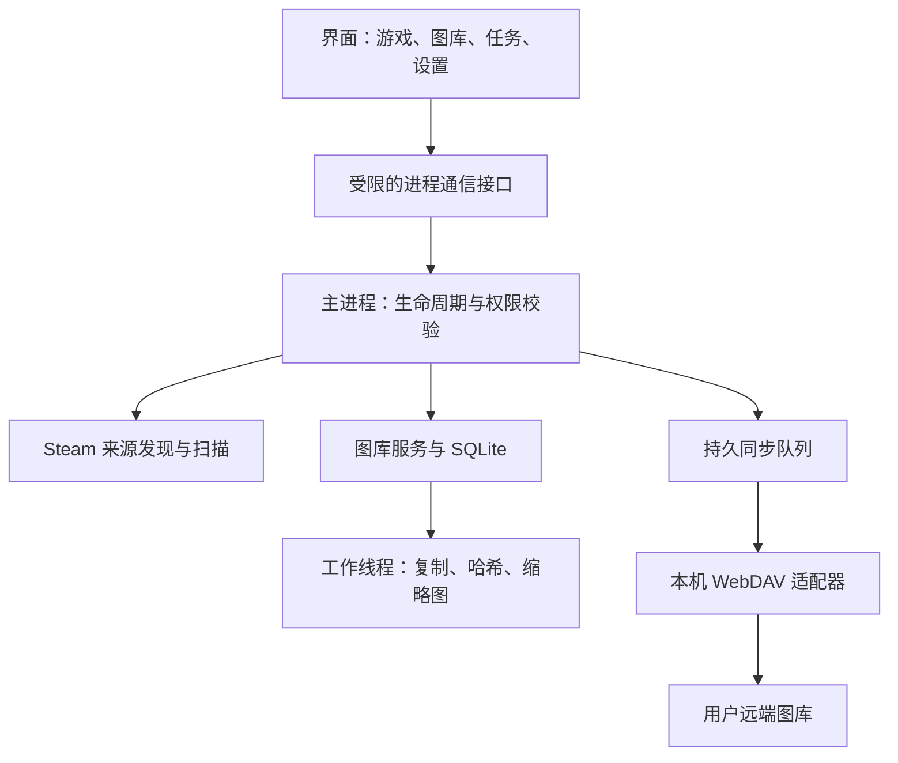

# 技术架构与数据模型

状态：设计建议，未实现。同步落盘规则以 [同步协议](sync-protocol.md) 为准。

## 1. 技术与进程

Electron + TypeScript + 本地 SQLite；界面建议 React。依赖具体版本由实施者在 工程基础阶段 检查维护状态、授权和 Electron 兼容性后锁定。只建立一个桌面项目，不加服务端、微服务或多仓库。



界面不直接访问文件系统、数据库或凭据。主进程只暴露明确的功能接口，禁止通用任意文件读写、任意命令执行接口。开启上下文隔离，界面关闭 Node 集成；不把远端返回的 HTML 当本地应用页面执行。

SQLite 由单个数据库拥有者串行处理事务；文件和网络任务不放在长数据库事务中。重计算在工作线程/独立进程，任务结果提交回拥有者。可根据最终 SQLite 库将拥有者放主进程或专用进程，要求页面不被慢查询阻塞。

## 2. 建议模块结构

以下只是未来代码目录建议，本轮不创建代码占位或运行配置。

```text
src/
  main/                 # 应用生命周期、托盘、受限通信
  preload/              # 类型明确的界面桥接
  renderer/             # 页面和组件
  shared/               # DTO、错误码、纯数据类型
  core/
    steam/              # 注册表、路径、ACF/VDF、发现与扫描
    library/            # 入库、索引、导出、缓存
    sync/               # 持久队列、远端目录、协议
    storage/            # 本地和 WebDAV 存取
    workers/            # 哈希、图片处理
tests/                  # 人工样本和隔离测试
```

渲染层不反向被核心依赖；Steam 扫描器只输出候选，不负责上传；存储适配器不决定游戏归属和删除规则。

## 3. 本机数据布局

应用设置、设备身份与任务数据库放 Electron 用户数据目录；用户选定的图库根目录存原件和本地描述记录。不得把真实图片或凭据放源码目录、安装包目录。

```text
<图库>/
  originals/<accountKey>/<gameKey>/<sha256>.<ext>
  metadata/<accountKey>/<gameKey>/<sha256>.json
  cache/previews/...
  staging/...
```

本地 metadata 是原件说明文件，用于数据库损坏后的本地图库重建，包含逻辑身份、哈希、字节数、时间与原文件名，不含任务、密码。本地来源绝对路径仅在本机数据库中保存。未归类文件放独立待归类区域，归类前不进入远端协议。

迁移图库路径首版可以通过导出/重新导入处理，不实现后台跨盘搬迁。执行中的任务必须绑定稳定图库标识；用户不能在任务运行时悄悄改变其目标目录。

## 4. SQLite 逻辑模型

这是概念表设计，不是已存在的 SQL。

| 实体 | 核心字段与唯一性 |
|---|---|
| profiles | accountKey、类型、Steam AccountID、可选 SteamID64、显示名；不要混用两种 Steam ID |
| games | gameKey、Steam AppID/自定义标识、本机别名、名称来源、安装状态 |
| sources | sourceId、根目录、真实路径、账号/游戏映射、扫描选择、最近成功扫描 |
| assets | assetId、accountKey、gameKey、sha256、bytes、format、尺寸、时间值/来源/可信度；唯一 accountKey＋gameKey＋sha256 |
| source_files | sourceId、相对路径、文件大小/mtime、可选文件标识、assetId、存在状态；一个资产可有多个来源 |
| local_copies | assetId、受管理路径、校验时间、存在状态；路径失效不删除资产身份 |
| remotes | remoteId、libraryId、地址/根路径、凭据引用、格式版本；密码不进普通字段 |
| remote_objects | remoteId、assetId、objectKey、recordId、发布/验证状态、验证时间；资产可有多个远端物理副本 |
| jobs | jobId、类型、assetId/sourceId、remoteId、状态、尝试次数、下次重试、错误码、恢复所需上下文 |
| settings | 本机偏好与扫描/同步选择；不通过共享 SQLite 同步 |

必要索引：游戏分页、账号＋游戏＋哈希唯一键、待执行任务的状态与下次运行时间、remoteId＋recordId 唯一键。迁移有版本号，失败时保持原库可恢复，不自动删除数据库“重新开始”。导入状态由实际文件与记录共同决定，不能仅靠 UI 内存。

## 5. 来源识别与导入

1. Windows 注册表发现 Steam 根目录；手动选择为可靠兜底。合并同一真实路径，避免符号链接重复扫描；来源和目标路径解析后检查包含关系。
2. 枚举 userdata 用户目录，读取 `760/remote/<AppID>/screenshots` 原图，忽略 thumbnails。
3. 读取 VDF 补充元数据；解析失败记录问题，继续扫描文件，不通过写回“修复”Steam。
4. 读取用户高质量副本配置。2026-09-20 在真实数据上实测：`userdata\<AccountID>\config\localconfig.vdf` 中实际存在的字段是 `InGameOverlayScreenshotSaveUncompressed`（`0`/`1` 开关），调研快照里写的 `InGameOverlayScreenshotSaveUncompressedPath` 在该机器上**不存在**。实现必须同时容忍开关缺失、字段改名、路径字段不存在三种情况，不得绑定单一字段名。对于额外目录，按明确规则归属，无法可靠判断的待归类。
5. `libraryfolders.vdf` 发现各游戏库，再读 appmanifest 名称。使用真正 VDF/ACF 解析器，不用只适配一种缩进的正则代替完整解析。
6. 对文件稳定性做有限重试；复制来源到 staging 并计算哈希。复制前后核对来源状态，变化则放弃本次候选、稍后重试，避免永久遗漏。
7. 本地发布使用同一文件系统临时文件与安全改名；现有目标必须核对哈希，禁止直接覆盖。写说明文件，再用短事务更新数据库；崩溃后通过 staging/说明文件对账恢复。
8. 输入目录不可达时标记扫描失败，不将整批图片视为用户删除。只有成功扫描中的明确缺失才更新来源存在状态。

不得重新编码原件、往原件注入 EXIF 或以图像相似度丢弃图片。图片解析失败只影响预览与尺寸提取；已识别格式的字节仍应保留并提示异常。

## 6. 逻辑身份

Steam 账号用 `steam-<AccountID>`，Steam 游戏用 `steam-<AppID>`。手动来源的账号/游戏用 `local-<UUID>` / `custom-<UUID>`，创建后固定；新设备从远端记录复用这些标识，不凭显示名自动合并。

非 Steam 快捷方式的截图目录名**不是商店 AppID**，而是 Steam 生成的 64 位 gameID。2026-09-20 实测确认：

```text
gameID = (storedAppid << 32) | 0x02000000
```

- 低位恒为 `0x02000000`（实测两个目录名的低 32 位都精确等于 33554432）。
- `storedAppid` 取自 `userdata\<AccountID>\config\shortcuts.vdf` 中该快捷方式 `appid` 键后紧跟的 4 字节小端整数（二进制 VDF，type=0x02）。
- 该值**无法**用 `crc32(小写 exe 路径 + 小写名称)` 复算（实测 8 种大小写与引号组合均不命中），必须以 `shortcuts.vdf` 存储值为权威来源。
- 此类游戏使用独立的 gameKey 命名空间，不得当作商店 AppID；名称同样从 `shortcuts.vdf` 解析。实测样本中 `12117857072981213184` 对应 GTNH、`9895728319305875456` 对应 osu!。

设备 ID 在每个安装实例初次运行时生成，不能写死在安装包或从远端复制。手动复制应用数据到新设备时必须重置设备 ID 和未提交上传尝试，避免两台设备共用写入命名空间。

同一账号＋游戏＋SHA-256 是逻辑资产。同字节但不同游戏/账号不合并逻辑身份。跨格式同画面保留多个资产。首版已发布身份不提供跨端重新归类；待归类先确认再发布。

## 7. 通信接口约定

以下为实施时应提供的功能契约，可用类型化 IPC；不是公网 HTTP API。

| 操作 | 输入 | 返回/行为 |
|---|---|---|
| discoverSources | 可选用户选定根目录 | 发现项、账号、可用性；不返回凭据配置全文 |
| scanSources | 已登记 sourceId 列表 | scanJobId；通过进度事件汇报结果 |
| importCandidates | scanJobId、候选选择 | importJobId、跳过/失败原因 |
| listGames / listAssets | 筛选、排序、游标与限制 | 分页数据、稳定下一页游标 |
| getAsset | assetId | 元数据、本机/远端状态、受限预览地址 |
| exportAssets | assetId 列表、已选择目录句柄/标识、规则 | exportJobId；路径由后台校验 |
| testRemote / bindRemote | 连接参数、用户授权的测试目录 | 分项能力结果/remoteId；密码不回传 |
| sync / restore | remoteId、游戏/资产选择 | jobId；上传与下载选择分别持久化 |
| pause / resume / retry | jobId 或明确的任务范围 | 更新结果，不能重复调度同一活动任务 |

所有输入运行时校验；错误返回稳定 code、中文 message、retriable、jobId。进度包含阶段、已处理/总量（未知可空），不伪造百分比。预览地址由资产 ID 映射受管理路径，禁止界面拼路径读取任意文件。

### 7.1 任务状态与错误码（WebDAV 上传阶段 前定稿）

任务主状态、phase 细分与重试策略按[同步协议](sync-protocol.md)第 8 节执行。错误码清单在 WebDAV 上传阶段 开始前定稿并冻结，之后只追加。

错误统一返回 `{ code, message, retriable, jobId, phase }`：code 取下表稳定标识，界面文案由 code 映射产生，不得解析 message，也不得依赖服务端返回文本判定结果；message 为中文，只用于日志和展开详情。新增 code 只追加，不修改已有语义，不复用已废弃 code。

| 错误码 | 触发条件 | retriable | 默认处置 |
|---|---|---|---|
| SRC_NOT_FOUND | 来源根目录不存在或盘符脱机 | 是 | 标记来源不可用，不判定删除，等待补扫 |
| SRC_UNREADABLE | 权限不足或读取失败 | 是（有上限） | 标记来源异常，跳过该目录本轮 |
| SRC_VDF_PARSE | VDF/ACF 解析失败或字段变化 | 否 | 继续扫描文件，附加信息标为缺失 |
| SRC_UNSTABLE | 复制前后来源状态发生变化 | 是 | 放弃本候选，交给下次补扫 |
| SRC_OVERLAP | 图库与来源路径相同、重叠或嵌套 | 否 | 拒绝该目标，要求用户改选 |
| LIB_DISK_FULL | 目标盘空间不足 | 是（用户处理后） | 暂停受影响写入任务，保留已完成数据 |
| LIB_FILE_LOCKED | 目标文件被其他程序占用 | 是 | 有限重试后标记失败，不删来源 |
| LIB_HASH_MISMATCH | 本地发布后核对哈希不一致 | 否（需人工） | 停止该资产，保留来源，不标已归档 |
| LIB_PATH_INVALID | 路径越界、超长、Windows 保留名或非法字符 | 否 | 按规则改名或要求用户改选目标 |
| LIB_DB_CORRUPT | 数据库损坏或迁移失败 | 否 | 保留原库，走本地说明文件重建流程 |
| DAV_AUTH | 401 | 否 | 暂停该连接，提示认证问题 |
| DAV_FORBIDDEN | 403 | 否 | 暂停该连接，提示权限问题 |
| DAV_TIMEOUT | 超时、断网 | 是 | 有上限的指数退避，保留已完成操作 |
| DAV_RATE_LIMIT | 429 | 是 | 尊重 Retry-After，降低并发 |
| DAV_CAPACITY | 507 或明确的容量不足响应 | 是（用户处理后） | 暂停上传，保留本地原件 |
| DAV_NOT_WEBDAV | 返回登录 HTML 或非 WebDAV 响应 | 否 | 判为连接不兼容，不作为空库或成功 |
| DAV_REDIRECT_REJECTED | 跨站重定向 | 否 | 拒绝跟随，不携带原站凭据 |
| PROTO_RECORD_INVALID | 记录结构或字段校验失败 | 是 | 暂不收录，保留诊断，下次补扫重试 |
| PROTO_RECORD_VERSION | 记录主版本不受支持 | 否 | 保留原数据，提示升级，不覆盖重建 |
| PROTO_OBJECT_MISSING | 记录有效但对应原件不存在 | 是 | 尝试同一资产其他副本，全部失败则显示异常 |
| PROTO_OBJECT_HASH_MISMATCH | 下载或读回校验哈希不符 | 是（有限次） | 换其他副本或换新路径重传，持续失败交用户 |
| PROTO_PATH_UNSAFE | 绝对路径、`..`、反斜杠、外部 URL 或编码后越界 | 否 | 拒绝该对象或记录 |
| PROTO_SIZE_LIMIT | 响应体或字段超过约定上限 | 否 | 拒绝该次响应，标记异常 |
| APP_INTERNAL | 主进程未预期的内部错误 | 否 | 记录脱敏日志，向界面返回稳定码，不把堆栈泄漏到界面 |

同步协议第 8 节的错误分类是本表的来源；两者不一致时以本表为准，并同步修订同步协议，避免两处口径漂移。

## 8. 凭据、网络与本机文件边界

WebDAV 访问在后台进行，使用操作系统凭据保护或 Electron safeStorage。编辑连接时默认保留现有密码，只在用户明确更换时写入；防止自动填充变成意外更新。移除连接只移除配置，不清理远端。

默认 HTTPS，允许用户明确选择自己可信的 HTTP 局域网端点并说明明文传输。不得全局禁用证书验证；跨站重定向不能携带原站凭据。诊断日志屏蔽认证头、密码、URL 中的敏感参数。第三方图片、游戏名、VDF 和远端 JSON 均视为输入数据，不作为程序指令。

### 8.1 诊断包内容边界

诊断包默认只含：应用与依赖版本、操作系统与架构、数据库 schema 版本、各类实体计数、任务状态与错误码统计、远端能力探测结果、脱敏后的错误详情与时间线。

默认排除：WebDAV 密码与令牌、认证头、URL 中的账号与查询参数、Steam 来源绝对路径、本机图库绝对路径、原文件名、图片内容本身。需要原文件名或路径定位问题时，由用户逐项勾选后再加入，并在包内标注实际包含的内容。诊断包不得成为绕过凭据与路径保护读取文件的通道。

远端返回的 objectKey 必须是本图库内的相对路径，拒绝绝对路径、`..`、反斜杠、编码后的越界路径和外部 URL；规范化 URL 后再次验证源站与路径前缀。远端尺寸声明不能直接用于无限内存分配，设置响应/记录大小限制。

## 9. 桌面生命周期与发布

单实例运行；关闭窗口可留托盘，显式退出则安全停止任务并落状态。退出不等待无界网络调用，重启能重试。开机启动默认关闭，由用户选择；更新不是首版必需功能。

工程基础阶段 验证 SQLite 原生模块适配 Electron 及打包产物，不能只测试 Node 下的开发脚本。产品数据放安装目录外，重新安装不能覆盖图库。没有签名证书时如实说明 Windows 安装提示，不宣称已签名。

卸载与数据处置：卸载程序不删除用户图库目录，也不触达远端。凭据随 Electron 用户数据目录一同失效（safeStorage/DPAPI 记录移除后视为已清除）。应用提供显式的“清除本机数据”入口，二次确认后只清除本机数据库、缓存与凭据引用，并说明图库原件与远端记录会保留。设备 ID 随用户数据目录一起移除，重新安装后按第 6 节生成新设备 ID。卸载流程与“清除本机数据”都不得成为删除远端或来源图片的路径。
