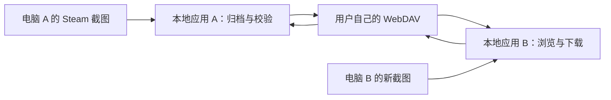

> 历史调研快照：保留 2026-09-20 调研阶段的原始结论与证据边界。当前技术栈、范围和同步协议以本项目 README 及规划文档为准；下文“未确认/建议”描述的是当时状态。
>
> 本文正文按原样保留、不改写。其中已被真实数据修正的条目（高质量副本字段名、VDF 索引完备性、多格式假设）见 [真实数据快照](evidence/real-data-structure.md) 第 5.2 节。

# Steam 截图管理与 WebDAV 同步：调研及建议方案

调研日期：2026-09-20。状态：**方案建议，尚未实施**。目标是保存、整理并跨电脑恢复珍贵截图；优先本地应用，存储可替换，不要求 NAS 或自建业务服务。

## 1. 结论与建议

技术上可行。推荐 **Windows 本地应用 + 本地图库 + 用户自己的 WebDAV 存储**。NAS 只是 WebDAV 的一种来源，换存储不应更换应用。截图采集和归档不依赖 Steam 登录、Steam 社区上传或在线游戏库接口。

首版闭环：识别本机截图 → 按游戏浏览和统计 → 原样复制进独立图库 → 上传并校验 → 新电脑绑定同一存储 → 按游戏下载和导出。

默认采用“新增内容在设备间汇集”，本机源文件消失不传播删除。不要把一般文件夹镜像同步直接当作珍贵图片的保护方案。远端空间仍受所选服务额度限制；绕开的是 Steam 上传渠道，不是消除存储成本。

## 2. Steam 文件如何识别

### 2.1 常规截图目录

```text
<Steam安装目录>/
  userdata/
    <AccountID>/
      760/
        screenshots.vdf
        remote/
          <AppID>/
            screenshots/
              <图片文件>
              thumbnails/
```

- AccountID 是本机用户目录使用的账号编号，不能直接当作 Web API 使用的 SteamID64。
- AppID 是游戏的 Steam 应用编号；目录本身就能提供游戏归属。
- `thumbnails` 是预览图，不能算成另一张原始截图。
- `screenshots.vdf` 是 Valve 文本配置格式的截图索引，可以补充拍摄时间、尺寸、游戏编号等信息；应当辅助读取，不能作为唯一发现入口。
- 图片一般不在游戏安装目录 `steamapps/common/<游戏>` 内。卸载游戏后的遗留截图也应扫描，不能只遍历“已安装游戏”。

依据：[Steam Deck 取证研究，第 5.2.6 节](https://dfrws.org/wp-content/uploads/2024/03/Well-Played-Suspect-Forensic-examination_2024_Forensic-Science-Internati.pdf)、[实际扫描实现](https://github.com/fmartingr/games-screenshot-manager/blob/latest/steam.go)。这些是研究实测和第三方实现，**不是 Valve 承诺永远稳定的目录协议**。

### 2.2 高质量副本与额外目录

Steam 可以另存高质量副本。已有实现读取用户 `config/localconfig.vdf` 中的 `InGameOverlayScreenshotSaveUncompressedPath`；该字段属于实现细节，需要兼容缺失和变更，并允许用户手动选目录。[读取实现](https://github.com/The-Noah/steam-screenshot-organizer/blob/master/src/steam.rs)

Valve 2024-02-27 的客户端更新明确加入保存 HDR AVIF 截图的支持。因此不能照搬仅扫描 `.jpg` 的脚本。建议原样接纳 JPEG、PNG、AVIF、TGA 等已识别图像；无法预览的格式仍允许备份，界面显示预览不可用。HDR 的原始文件和 SDR 预览图要分开，不能为了缩略图转换而覆盖原件。[Valve 更新](https://store.steampowered.com/news/posts/?enddate=1709064894&feed=steam_community_announcements)

常规 JPG 与高质量 PNG/AVIF 即使画面相同，也不是字节重复文件。首版保留全部版本，可提示疑似同一拍摄的多个版本，不以相似图判定直接丢弃。外部副本的归属优先来自截图索引、可靠命名信息或用户配置；不确定的进入“待归类”，不猜游戏后静默归档。

游戏自身拍照模式、显卡工具、Xbox Game Bar 的截图不保证在 Steam 目录里。首版用“添加文件夹并指定游戏”补充，逐游戏自动规则可后续扩展。

### 2.3 建议扫描步骤

1. Windows 优先读取注册表 `HKCU/Software/Valve/Steam` 的安装路径，检查实际目录；失败时尝试常见目录，仍失败则让用户选择。支持多个 Steam 根目录和旧盘目录。
2. 枚举所有本机 Steam 账号，展示后由用户选择采集范围，不擅自只取第一个账号。
3. 按上述常规路径扫描原件，再扫描已配置的高质量副本和手动目录。
4. 目录存在的图片优先保留；VDF 缺失、失效或解析失败时继续采集，并报告哪些附加信息缺失。
5. 新文件大小、修改时间稳定后再复制；复制前后重新核对来源状态，变化则延后重试。新建文件事件不能代表文件已写完。
6. 对独立图库中的最终字节计算 SHA-256（内容指纹），以“账号 + 游戏 + 内容指纹”识别精确重复，保留多个来源记录。
7. 启动时补扫、后台监听、定期补扫组合使用；休眠、程序未运行或监听遗漏不能造成永久漏图。

本轮只实测 Windows 安装发现。Linux/Steam Deck 常见根为 `~/.local/share/Steam`，还存在 `.steam/steam` 符号链接与 Flatpak 路径；macOS 常见根为 `~/Library/Application Support/Steam`。跨平台路径需要独立样本测试，首版先做 Windows。

### 2.4 游戏名称与列表

将三个集合区别显示：**有截图的游戏、已安装游戏、在线账号拥有的游戏**。

本地名称来源：解析 `steamapps/libraryfolders.vdf` 找到各游戏库，再读各库 `steamapps/appmanifest_<AppID>.acf` 的 `appid`、`name`。这是本轮在本机读取到的真实字段，也能在现有整理工具中找到对应实现。[源码](https://github.com/The-Noah/steam-screenshot-organizer/blob/master/src/steam.rs)

名称解析优先级建议：用户自定义 → 已缓存名称 → 本地安装清单 → 可选在线查询 → `未知游戏（AppID）`。名称未知不影响采集与上传，游戏改名不移动远端存储。非 Steam 快捷方式编号不应强行当作商店 AppID，允许手动映射和命名。

## 3. Steam API 的作用和边界

| 能力 | 用途 | 边界 |
|---|---|---|
| Steam OpenID | 验证用户身份，得到 SteamID | 不授予访问硬盘或完整私有游戏库的权限 |
| `IPlayerService/GetOwnedGames` | 获取可见的已拥有游戏、可选名称与图标信息 | 需要 API key；受游戏详情可见性影响 |
| 本地 ACF/VDF | 离线识别安装目录、部分名称、截图附加信息 | 非稳定公开协议，需要容错与样本回归 |
| `ISteamScreenshots` | 游戏集成截图、添加截图、触发截图和设置标记 | 不是通用应用枚举电脑上所有游戏历史截图的接口 |

依据：[官方身份认证](https://partner.steamgames.com/doc/features/auth)、[GetOwnedGames](https://partner.steamgames.com/doc/webapi/IPlayerService)、[ISteamScreenshots](https://partner.steamgames.com/doc/api/ISteamScreenshots)。

公众 Web API 使用 `https://api.steampowered.com`；不要照抄合作伙伴文档示例就把普通用户请求发到发行商专用服务器。[官方 Web API 概述](https://partner.steamgames.com/doc/webapi_overview)

没有发现可供本产品直接调用、枚举任意游戏所有未上传本地截图的公开 Web API。网上“下载 Steam 截图”的项目有些处理的是已发布社区图片，与采集本机文件是两条链路。

首版不强制登录、不收集 Steam 密码，不把 API key 内置到发布包。后续补完整游戏库时，个人使用可以自行配置 key；面向公众的账号服务需要另行设计密钥与回调处理，OpenID 登录本身不等于已获得游戏库授权。

## 4. 类似项目与复用判断

以下为本轮阅读 README 和部分源码后的判断，未安装或运行这些项目，不能视作可用性验收。

| 项目 | 已核实能力 | 对本需求的差距与用途 |
|---|---|---|
| [Steam Screenshot Utils](https://github.com/kikones34/steam-screenshot-utils) | 备份常规截图、按游戏命名整理副本、合并两类目录 | Python 命令行；适合参考提取规则。名称解析依赖未文档化接口，排序命令会原地整理，不能未经检查直接用于珍贵原件 |
| [Steam Screenshot Organizer](https://github.com/The-Noah/steam-screenshot-organizer) | 后台整理自定义截图目录、监测新文件 | Rust；README 标明 Windows 为主。源码会移动文件，Windows 路径有硬编码，多账号处理较简化；适合参考，不适合直接充当备份核心 |
| [Games Screenshot Manager](https://github.com/fmartingr/games-screenshot-manager) | 多来源收集、按游戏和时间组织、封面与静态画廊 | 最接近图库收集侧；当前 Steam 扫描仅匹配 `.jpg`，初始化要求 API key；未看到完整桌面 WebDAV 多端冲突处理闭环 |
| [rclone](https://rclone.org/webdav/) | WebDAV 等存储传输 | 不理解 Steam 游戏归属和图库状态；适合传输验证或后续多存储适配 |

Games Screenshot Manager 仓库标注 GPL-3.0，Steam Screenshot Organizer 标注 MIT；真正复用代码前需按选定版本检查授权。此处建议借鉴目录识别与用户流程，自行实现小范围核心，而不是把几个脚本直接打包成最终产品。

注意 rclone 的 `copy` 不清理目标端多余文件，但仍可能更新同路径目标；单靠 `copy` 不等于内容不可覆盖。`bisync` 会传播修改和删除，需要状态与冲突管理。我们应先给图片建立稳定内容标识，再决定是否复用传输工具。[copy 文档](https://rclone.org/commands/rclone_copy/)、[bisync 文档](https://rclone.org/bisync/)

本轮没有确认某个现成成品同时完整覆盖全部要求；这不等于证明互联网上不存在。

## 5. 为什么以桌面客户端为主

| 形态 | 本机扫描 | 后台同步 | 依赖 | 结论 |
|---|---|---|---|---|
| 纯 NAS 网页 | 用户先授权选择目录 | 受页面生命周期与浏览器能力限制 | NAS 页面/服务 | 适合手动导入、浏览 |
| 网页 + 本机助手 | 助手负责扫描 | 可以 | 网页和助手两套组件 | 能做，但首版引入额外安装与通信 |
| 本地桌面应用 | 可发现路径并在选定范围扫描 | 托盘中持续运行 | 本机程序 + 可选 WebDAV | 推荐 |

浏览器文件访问需用户交互与授权；换电脑打开页面不会自动取得那台电脑硬盘权限。后续即使保留 NAS 图库网页，采集仍应由本地程序或用户手动选目录完成。[Chrome 文件访问文档](https://developer.chrome.com/docs/capabilities/web-apis/file-system-access)



两台电脑无需同时在线，但各自同步时需要能访问同一个 WebDAV。应用无需知道远端到底是 NAS、托管网盘还是服务器。

## 6. 建议的首版用户流程

1. 初次打开：显示发现的 Steam 路径和账号，选择要收集的范围，也可添加旧硬盘或高质量截图目录。
2. 扫描预览：按游戏显示张数、体积、重复数、无法归类项；未知名称不阻断导入。
3. 选择独立图库目录：将原始字节复制进入图库，保留 Steam 原件。展示本地额外占用与可用空间。
4. 可选绑定 WebDAV：填写地址、账号或应用密码、远端根目录；测试列目录、写入、读取校验和临时文件清理。测试仅作用于随机新建的专用目录。
5. 选择同步范围：全部游戏或指定游戏；后台新增自动上传，可暂停、限速、重试。
6. 新电脑绑定同一存储：先拉取清单，可先看游戏和数量，再下载选定游戏原件；恢复不依赖旧电脑仍在线。

首版页面建议为四个：游戏列表、游戏截图网格、同步任务、设置。统计至少有图片文件数、占用、待上传、远端已校验、本机已下载；精确重复按规则折叠，但 JPG 与高质量版本分别计文件，避免统计口径误导。

## 7. 存储格式与多端一致性

### 7.1 可搬迁、可重建的数据

```text
<WebDAV根目录>/steam-gallery-v1/
  library.json
  originals/<account-id>/<game-id>/<sha256前2位>/<完整sha256>.<扩展名>
  records/<device-id>/<YYYY-MM>/<record-id>.json
  previews/<缩略图标识>.jpg              # 可选，可重新生成
  staging/<device-id>/<upload-id>         # 未完成上传，不展示
```

这是建议格式，不是 Steam 的目录规范。

`library.json` 只存库标识和格式版本，初始化一次，避免每次同步都争抢修改全局文件。图片按内容寻址且不覆盖；记录由各设备写入自己的目录，以独立唯一文件追加。首版不允许原地编辑远端记录。每台设备的 SQLite 数据库只用于本机查询与任务恢复，**不通过 WebDAV 同步一份共享 SQLite 文件**。

记录至少包含：格式版本、账号标识、游戏标识、可选游戏名、原文件名、图片路径、SHA-256、字节数、格式、尺寸、可选拍摄时间、时间来源/时区可信度、导入时间和来源设备。完整本机绝对路径只存本机，不必同步到远端。

文件名时间通常不能证明时区。优先读取可信截图元数据；只剩文件名或修改时间时标明推断来源，不伪造精确 UTC。游戏名只是展示字段，不能作为唯一标识。

新设备通过有效记录重建索引；同一图片被多设备发现时合并来源，按内容指纹去重。无引用的原件和未完成记录进入待核对，首版不自动清理。命名规则只用于用户导出，例如：

```text
<账号>/<游戏名>_<AppID>/<年份>/<原文件名>_<hash短码>.<扩展名>
```

遇到碰撞延长指纹或保留两份，必须处理 Windows 保留名称、非法字符、大小写与路径长度。修改导出规则不批量重命名远端原件。

### 7.2 上传、恢复与校验

1. 先确保本地归档文件完整，写入持久任务队列。
2. 上传独立临时路径；服务端支持且实测可靠时使用 MOVE 发布到最终路径，防覆盖条件也要验证。
3. 若目标已存在，核对内容，不因同名直接跳过。服务端不支持可靠条件发布时，需要采用设备唯一对象路径，接受物理重复，应用层去重；不能硬套覆盖语义。
4. 默认读回远端原件计算 SHA-256，一致后才发布对应记录。额外下载流量是可靠验证的成本；后续可适配可信的服务端校验能力。
5. 消费端忽略临时对象与无效记录；即使见到记录，下载图片后也必须复核哈希。断网后从持久队列继续，操作可重复执行而不重复计数。
6. 下载写本地临时文件，校验一致后再移入图库。完成后才显示“本机已恢复”。

WebDAV 标准提供文件和目录操作，但各服务实现不同。rclone 官方文档也明确通用 WebDAV 对修改时间与哈希支持有局限；**ETag 不能普遍当成内容哈希**，同尺寸也不代表同内容。[WebDAV 标准](https://www.rfc-editor.org/rfc/rfc4918)、[rclone WebDAV 说明](https://rclone.org/webdav/)

因此首版承诺“任务中断后可继续处理”，不承诺所有 WebDAV 都支持单张图片的字节级断点续传。小图片失败后整文件重传即可；供应商专有分块上传不进入首版。

### 7.3 删除规则

- Steam 源目录删除：标记来源失效，独立图库和远端保留。
- 清理本机已下载副本：不删除远端记录和原件。
- 远端文件缺失：标记异常；本机有完整副本时可补传，不把缺失当成用户删除意图。
- 首版不做跨端永久删除。以后真要支持，需加入明确删除记录、恢复窗口和过期设备规则。

本地副本加远端副本能抵御单台电脑更换或损坏；远端本身损坏、被整体删除或账号失效仍可能造成损失。对这些珍贵资产，建议另留离线副本或采用存储端历史版本。此建议直接服务于防丢图目标，不是首版要新增一套备份平台。

### 7.4 WebDAV 兼容验收

建议至少验证一种托管服务和一种自建实现，覆盖：目录枚举、中文/空格路径、认证失败、只读权限、容量用尽、重定向、弱/无 ETag、MOVE 不支持、并发上传同一图、断网重试。

不能以 HTTP 200 直接认定成功；目录操作检查 WebDAV 响应和逐项状态，下载检查内容与哈希，登录 HTML 不得当文件保存。用户 NAS 的特定外链当前能否直接接标准 WebDAV，本轮没有连接验证；不把历史连通记录当作当前验收。若外链依赖厂商登录中继，作为单独适配处理，不能污染通用 WebDAV 核心。

## 8. 技术实现建议

首版建议 Electron + TypeScript + React + 本地 SQLite。桌面主进程负责文件发现、扫描与 WebDAV 任务，界面只负责浏览和操作；耗时哈希与缩略图生成放工作线程或独立进程，避免卡住窗口。这是结合本项目需求的工程建议，并非框架性能已做实测比较。[Electron 进程模型](https://www.electronjs.org/docs/latest/tutorial/process-model)

WebDAV 请求由本机后台执行，避免要求服务端适配浏览器跨域。模块保持简单：Steam 扫描器、本地图库、同步任务、存储适配器。首版只实现本地目录和 WebDAV，不引入自建云端账号体系、中央数据库或多供应商自动切换。

密码使用操作系统保护的本地凭据存储，或 Electron `safeStorage` 加密落盘；不进入图库清单、日志或导出文件。Windows DPAPI 的保护范围主要是不同系统用户，不代表可抵御同一用户下所有程序。Linux 无安全密钥存储时不静默回退成明文。[官方说明](https://www.electronjs.org/docs/latest/api/safe-storage)

若今后更重视安装包与常驻内存，可再评估 Tauri；本轮未基准测试，不凭框架宣传给出内存或体积承诺。

## 9. 实施阶段和验收

| 阶段 | 交付 | 通过条件 |
|---|---|---|
| A：采集验证 | 只读扫描清单、归属、独立复制导出 | 对照用户真实 Steam 截图逐游戏核数，支持多账号、自定义路径、卸载游戏遗留图；原件不变 |
| B：桌面图库 | 游戏列表、截图网格、统计、筛选、导出 | 断网仍可浏览本机图片；未知名称不阻断；缩略图不重复统计 |
| C：WebDAV 闭环 | 上传、读回校验、新设备下载、任务恢复 | 电脑 A 入库 → 远端 → 干净环境 B 重建，原件哈希全部一致 |
| D：后台可靠性 | 自动新增收集、补扫、失败重试、暂停与限速 | 重启、断网、休眠、多设备并发后无静默漏图与误覆盖；本机删图不删远端 |
| 后续增强 | 在线拥有游戏库、Linux/Deck、可选 NAS 只读图库 | 分别验证 API 可见性、平台路径和网页认证，不阻碍首版 |

还需覆盖：同名异内容、同内容多来源、JPG/PNG 双版本、HDR 原件备份、VDF 损坏、源文件写入中、目标盘满、远端返回伪成功、失效凭据、十万文件目录规模的列表性能。

首版恢复目标是本应用图库或用户选择的普通目录。**“图片回到电脑”不等于“Steam 原生截图管理器也恢复索引”**。自动修改 Steam 的 VDF、向各游戏原目录注入记录、同步存档/录像、公开分享、多用户权限均不属于建议首版范围。

## 10. 本轮验证边界

- 已只读检测本机 Steam 根目录：`C:/LocalSpace/softwares/Steam`。
- 已读取本机 `libraryfolders.vdf` 结构和一个安装清单的 AppID/name 字段。
- 检测到一个 userdata 用户目录，但标准 `760` 截图目录与 `screenshots.vdf` 未发现；查找的用户配置中也未发现高质量截图路径字段。不能据此宣称本机或旧硬盘完全没有截图。
- 已阅读 Valve、Chrome、Electron、rclone 官方资料及上述三个开源项目的 README/部分源码。
- GitHub 公共 API 返回 `API rate limit exceeded`，未取得可信的最新提交时间；未据此断言项目维护活跃程度。
- 未运行第三方整理程序，未上传、移动或改写用户图片；未连接 NAS/WebDAV，未执行真实双端恢复。
- 未创建产品代码或 OpenSpec 变更提案。本文件是本次调研的建议，后续实施范围需由用户选定。
